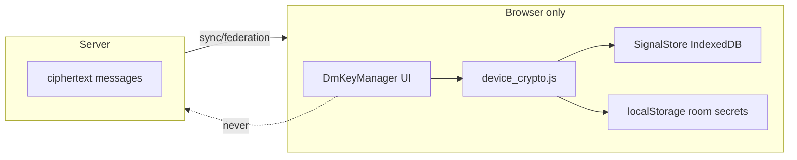

# DM & room key manager — implementation plan (handoff)

**Audience:** Fresh agent implementing client-side encryption backup UX.  
**Date:** 2026-05-22  
**Status:** Plan only — do not treat as shipped.

---

## Product intent (from user)

1. **Per-chat (DM) privacy** — Key backup belongs in the **conversation’s privacy UI**, not scattered in chat overflow menus or a header 🗝️ button. Today “Privacy settings” in the chat **⋯** menu opens `showDisappearSettings()` in `dms.js` (disappearing messages + disable forwarding). **Extend that modal** with encryption backup for **this DM only** (import keys to unlock history with this peer; optional export of this peer’s session).

2. **Global key manager** — **Settings → Privacy** (not Security) gets a **full polished** key manager: export/import, **select all / select some** DMs (and private groups), themed file extension, restore DMs + private group decrypt ability.

3. **Client-only** — Passphrase and private keys **never** go to the server. Server only ever stores ciphertext. Reuse `device_crypto.js`; do not add server endpoints for key blobs except existing operator `device-crypto-blob` switch-ticket path (out of scope for this UX).

4. **In-chat locked messages** — Keep a **single** inline action: **Import keys** on `[[DMLOCK]]` bubbles and `[[DMSYS]]` cards (opens import flow). **Remove** export/import from chat header ⋯ menu and remove header `dm-keys-btn` if still present.

5. **Cache** — Users reported stale JS; bump `?v=` on every touched asset and mention hard refresh in release notes.

---

## Current state (as of commit `5aafbaf` and follow-up discussion)

| Piece | Location | Notes |
|-------|----------|--------|
| Key file crypto | `node/static/js/device_crypto.js` | Magic `FROGTALK-KEY-v1`, PBKDF2 210k, AES-GCM. Export = full Signal snapshot + **all** `localStorage` room secrets (`ft-room-secret-v1:*`). Download name `frogtalk-{nick}-{date}.key`. |
| Key manager UI | `node/static/js/dm_key_manager.js` | Modal `#modal-ft-key-manager`, tabs Export/Import, delegates `[data-ft-key-action]`. |
| Lock UX | `node/static/js/dms.js` | `[[DMLOCK]]` JSON in memory; grey `.dm-lock-msg`; import link `data-ft-key-action="import"`. |
| Per-DM privacy modal | `dms.js` → `showDisappearSettings()` | Dynamic `#modal-disappear`; **no** key UI yet. |
| Chat ⋯ menu | `ui.js` → `openChatMoreMenu()` | Still has Export/Import items + “Privacy settings” → disappear modal. **Should remove** key menu items. |
| Settings Security tab | `index.html` `#set-pane-security` | Short “DM encryption backup” section with Export/Import buttons. User wants this **moved/rebuilt** under **Privacy** tab. |
| Message context menu | `messages.js` → `openActionSheet()` | Built from `.msg-actions` on each message; DMs have reply/react/copy/forward/edit/delete — **no** privacy/key entry. User clarified keys are **not** per-message; wire **chat-level** privacy only. |
| Server history | `auth.py` federation sync | Copies DM **ciphertext** only; decrypt needs keys in browser. |
| System lines | `node/dm_system_messages.py` | `[[DMSYS]]` for history import status; not key storage. |

**Not implemented today**

- Selective export (per-DM / per-room checkboxes).
- Themed extension (`.frog` / `.rabbit` / `.rabit`).
- Per-DM export (subset of Signal sessions).
- Inline Settings → Privacy panel (only modal + Security stub).
- Import that lists what will be restored before apply.

---

## Architecture principles (non-negotiable)



- **Export:** Read SS + LS → JSON plain payload → compress → encrypt with user passphrase → write file.
- **Import:** Read file → decrypt → merge into SS + LS (remap peer IDs via `global_user_id` in `address_book`) → re-init Signal → re-decrypt visible DMs (`_redecryptStaleDMMessages`, `_refreshDmLockPlaceholders`, `loadDMMessages`).
- **Selective export:** Filter `signal.sessions` / `signal.identities` and optionally `room_secrets` by selected peers/rooms before seal. Import merge strategy must be defined (see Phase 2).

---

## File format v2 (themed extension)

**Recommendation:** Keep magic string for compatibility; add optional `file_format_version: 2` inside sealed payload.

| Field | Value |
|-------|--------|
| Outer magic | Keep `FROGTALK-KEY-v1` OR add `FROGTALK-FROG-v2` (support both on import) |
| Extension | **`.frog`** primary; accept `.key`, `.json`, `.rabbit` (alias) on import |
| MIME | `application/vnd.frogtalk.key+json` (optional) |
| Plain payload | Existing `dct_version`, `dct_mode`, `address_book`, `signal`, `room_secrets` |
| New fields (v2) | `export_scope: 'full' \| 'partial'`, `selected_peers: [{gid, nickname}]`, `selected_rooms: [{storage_key, room_name?}]`, `app_version` |

**Implementation sketch**

- `device_crypto.js`: `exportKeyFilePayload(passphrase, { scope, peerGids, roomKeys })`, `downloadKeyFile(..., { extension: 'frog' })`.
- Import: if `export_scope === 'partial'`, call `_importPlainPayloadPartial(plain, { merge: true })` instead of full replace.

**Size limit:** Existing `DCT_PLAIN_MAX` (6 MiB) — selective export reduces risk; show friendly error in UI.

---

## UX surfaces (two tiers)

### Tier A — Per-DM: `showDisappearSettings()` modal

**File:** `dms.js` (modal HTML) + `dm_key_manager.js` (logic).

Add section below disappearing messages / forwarding:

```
🔐 Encryption for this chat
────────────────────────────
Status: [Locked — import keys from home] | [Ready]

[Import keys…]  — always show if any locked messages OR keys_needed
[Export this chat's keys…] — optional Phase 3; exports only session with _activeDM peer

Short copy: Keys stay on your device. Server cannot read messages.
```

**Data for status**

- Use existing `_dmDecryptLockContext`, peer `global_user_id`, `DeviceCrypto.hasExportableCrypto()`.
- Optional: `Signal.peerKeysDiagnostics(peerLocalId)` for “bundle on this node” hint.

**Open import**

- `DmKeyManager.open('import', { context: 'dm', dmId, peerGid })` — pre-select peer in global manager when opened from DM modal.

**Do not** add “Privacy / keys” to every message’s `openActionSheet` unless product explicitly asks later.

### Tier B — Settings → Privacy tab

**File:** `index.html` `#set-pane-privacy` + CSS in `index.html` (theme vars: `--text-muted`, `--accent-color`, `--border-color`).

Replace stub / remove duplicate from Security tab. Build **inline panel** (not only modal):

1. **Hero** — “Encryption backup” + privacy callout (same as modal).
2. **Status card** — identity present, # of DM channels, # of room secrets in LS, last export date (store `ft_last_key_export_at` in localStorage on success).
3. **Export panel**
   - Passphrase + confirm
   - **DM list** (checkboxes): “Select all” master + per-DM row: avatar, nickname, locked badge, peer gid (hidden)
   - **Private groups** list: rooms where `localStorage` has `ft-room-secret-v1:{room}` (derive display name from `State.rooms` or storage key)
   - **Include Signal identity** checkbox (default on; off = room-secrets-only mode for advanced users)
   - Button: **Download `.frog` file**
4. **Import panel**
   - File picker `accept=".frog,.key,.json"`
   - Passphrase
   - After file parse (magic ok): show **preview** — counts of sessions, rooms, export date, origin node — then **Restore**
   - On success: same `_afterImport()` as today + toast

**Tab open hook:** `ui.js` → `switchSettingsTab('privacy')` → `DmKeyManager.refreshPrivacyPanel()`.

### Tier C — In-thread only (keep minimal)

- `[[DMLOCK]]` → grey text + **Import keys** (`data-ft-key-import` — prefer dedicated attribute so Settings buttons don’t use delegation accidentally).
- `[[DMSYS]]` history cards → **Import keys** when reason is keys-related.

**Remove**

- `ui.js` chat menu Export/Import items.
- `#dm-keys-btn` from header + `_show('dm-keys-btn')` in `dms.js` + `rooms.js` display toggle.

---

## Module structure (refactor target)

Consolidate into **`dm_key_manager.js`** (or split only if file > ~400 lines):

| API | Purpose |
|-----|---------|
| `DmKeyManager.open(tab, opts?)` | Modal for quick import from locks |
| `DmKeyManager.mountPrivacyPanel()` | Bind Settings → Privacy DOM once |
| `DmKeyManager.refreshPrivacyPanel()` | Status + checkbox lists |
| `DmKeyManager.runExport({ source: 'modal' \| 'privacy' \| 'dm', selection })` | |
| `DmKeyManager.runImport({ source, file, passphrase })` | |
| `DmKeyManager.getExportableDmPeers()` | From `/api/dms` + lock state |
| `DmKeyManager.getExportableRooms()` | Scan LS prefixes |

**Contexts:** `opts.context === 'dm'` → open import tab, show subtitle “Unlock conversation with @nick”.

Keep compat aliases: `showDmCryptoKeysModal(tab)` → `open(tab)`.

**Script order** (`index.html`): `device_crypto.js` → … → `ui.js` → `dm_key_manager.js` (after `openModal`).

---

## `device_crypto.js` changes (Phase 2+)

### Phase 1 (minimal — ship UX first)

- `downloadKeyFile(passphrase, { filenameExt: 'frog' })`.
- Accept `FROGTALK-KEY-v1` and future magic on import.
- Expose `buildPlainExport()` / new `buildPartialExport({ peerGids, roomStorageKeys, includeIdentity })` — **can stub partial as full export** behind flag until Phase 2.

### Phase 2 (selective export/import)

**Export filtering** (sessions in `signal_store.js`):

- Address keys look like `{localUserId}.{deviceId}` for sessions; identities similar.
- Map selected peer gid → `source_local_id` via `address_book` at export time; filter `signal.sessions` where remapped address matches selected peers.
- Always include **own identity** if `includeIdentity` true.

**Import merge**

- Full import: current behavior (replace/merge sessions — verify `SignalStore.importSnapshot` semantics).
- Partial import: **merge** sessions and room secrets; never delete unrelated sessions. Add unit tests in browser devtools checklist.

**Room secrets**

- Keys: `ft-room-secret-v1:{roomName}` and `ft-room-keyver:{roomName}` — export both when room selected.

### Phase 3 (per-DM modal export)

- Export only sessions for `_activeDM` peer gid (+ identity).
- Smaller files for “backup this chat before wipe”.

---

## Post-import refresh (must run every time)

Already in `dm_key_manager.js` `_afterImport()` — keep and extend:

1. `window.__ftDctImported = true`
2. `__ftDmDecryptReset()`
3. `_redecryptStaleDMMessages()` if `_activeDM`
4. `_refreshDmLockPlaceholders()`
5. `loadDMChannels()` / `loadDMMessages(0)`
6. `ft:crypto-ready` event — `app.js` federation sync listener may refresh lock copy
7. **Add:** if in room with imported secret, `Messages.loadHistory` or room re-decrypt hook (find room message decrypt path in `rooms.js` / `wall_crypto.js`)

---

## CSS / theme

- Reuse `.ft-key-manager-*` classes; add `.ft-privacy-keys-panel` for Settings inline layout.
- Locked message grey: `#messages-area .msg-content.dm-lock-msg { color: var(--text-muted) !important; font-style: italic; }` — verify wins over `#main .msg-content { color: var(--text-color)!important }`.
- Light/dark: use CSS variables only; no hardcoded `#888` in new markup (legacy modal still has some — migrate when touching).

---

## Server boundary (explicitly out of scope)

- No upload of passphrase or plain keys.
- No new API routes for key backup.
- `POST /api/auth/device-crypto-blob` remains for **node switch ticket** (`FT_DCT_POLICY=transfer`) only.

Optional later: `POST /api/dms/{id}/crypto-sync-notice` client call after import (user-visible system line) — already exists; call from `_afterImport()` if desired.

---

## Implementation phases (recommended order)

### Phase 0 — Cleanup (0.5 day)

- [ ] Remove chat ⋯ Export/Import (`ui.js`).
- [ ] Remove/hide `#dm-keys-btn` (`index.html`, `dms.js`, `rooms.js`).
- [ ] Move Security tab DM backup block → delete after Privacy panel exists.
- [ ] Rename delegation to `[data-ft-key-import]` only for in-chat triggers.
- [ ] Bump `dm_key_manager.js`, `dms.js`, `device_crypto.js`, `index.html` cache versions.

### Phase 1 — Privacy tab MVP (1–2 days)

- [ ] Inline panel in `#set-pane-privacy` with full export/import (full backup, all DMs + all room secrets — same as today).
- [ ] Themed `.frog` download; import accepts `.frog`/`.key`.
- [ ] `switchSettingsTab('privacy')` refresh.
- [ ] Polish modal copy; fix “module not loaded” with script order check.

### Phase 2 — Per-DM privacy modal (1 day)

- [ ] Extend `showDisappearSettings()` with encryption section + Import (+ status).
- [ ] Import opens `DmKeyManager.open('import', { peerGid, dmId })`.
- [ ] Link from DM header timer area optional: “⏱️ / 🔐 Privacy” — keep one entry point (⋯ → Privacy settings).

### Phase 3 — Selective export UI (2–3 days)

- [ ] `getExportableDmPeers()` + `getExportableRooms()` lists with checkboxes.
- [ ] `buildPartialExport` + partial import merge in `device_crypto.js`.
- [ ] Import preview screen (counts + origin).
- [ ] Tests: manual matrix below.

### Phase 4 — Per-DM export + private group polish (1–2 days)

- [ ] Export-this-chat only from DM privacy modal.
- [ ] Room display names, search/filter if list long.
- [ ] Error states: `dct_export_too_large`, `wrong_passphrase`, `bad_key_file`.

### Phase 5 — Docs & ops (0.5 day)

- [ ] Update `docs/CROSS_NODE_STATUS.md` § key backup UX.
- [ ] Deploy static assets to fleet; note hard refresh.

---

## Manual test matrix

| # | Scenario | Expected |
|---|----------|----------|
| 1 | Travel node, synced history locked | Grey lock lines; Import opens manager; after import from home `.frog`, messages decrypt |
| 2 | Settings → Privacy → Export | Downloads `frogtalk-user-YYYY-MM-DD.frog`; file is JSON with `magic: FROGTALK-KEY-v1` |
| 3 | Import wrong passphrase | Clear error; no partial SS corruption |
| 4 | Import on travel after export on home | Sessions remapped by gid; live + old DMs with that peer decrypt |
| 5 | Private room secret in LS | Export/import restores decrypt in that room on same origin |
| 6 | Selective: one DM only | Export file smaller; other peers’ sessions unchanged after import |
| 7 | Per-DM privacy modal | Disappearing timer still works; import section visible |
| 8 | Chat ⋯ menu | No Export/Import items |
| 9 | Hard refresh after deploy | New `?v=` loads; modal works |

---

## Key code references

```15:16:node/static/js/device_crypto.js
  const KEYFILE_MAGIC = 'FROGTALK-KEY-v1';
  const KEYFILE_KDF_ITERS = 210000;
```

```257:271:node/static/js/device_crypto.js
  async function _buildPlainExport() {
    // signal snapshot + address_book + room_secrets (full)
  }
```

```4288:4334:node/static/js/dms.js
function showDisappearSettings() {
  // modal-disappear — extend here for per-DM key UI
}
```

```1972:1982:node/static/js/ui.js
    items.push({ icon: '🔐', label: 'Privacy settings', onclick: () => showDisappearSettings() });
    // REMOVE Export/Import items below
```

```10596:10607:node/static/index.html
      <!-- DM encryption backup block — MOVE to Privacy tab, then remove -->
```

---

## Risks & decisions for implementer

| Decision | Options | Recommendation |
|----------|---------|----------------|
| Extension name | `.frog` vs `.rabbit` vs `.rabit` | **`.frog`** primary; accept legacy `.key` |
| Partial import merge | Replace all vs merge | **Merge** for partial; full import can replace sessions |
| Identity required | Partial without identity | Require identity for DM decrypt; room-only export uses `dct_mode: room_secrets_only` |
| Signal session filter | By gid vs by dm channel id | **gid** — stable across nodes |
| Settings tab | Privacy vs Security | **Privacy** for backup UX; Security keeps PIN/recovery only |

---

## Out of scope (separate roadmap)

- `crypto_lane` DB column + in-thread lane divider (`CROSS_NODE_STATUS.md` P1).
- Stop syncing old DM ciphertext on travel (`auth.py` P2).
- Federated room secret transfer protocol (P4).
- Server-side key escrow (forbidden).

---

## Handoff checklist for fresh agent

1. Read this doc + skim `device_crypto.js`, `dm_key_manager.js`, `dms.js` (`[[DMLOCK]]`, `showDisappearSettings`).
2. Complete **Phase 0** cleanup first (user-visible confusion today).
3. Build **Privacy tab MVP** before selective export (Phase 1 before Phase 3).
4. Bump asset versions; deploy static files; ask user to hard refresh.
5. Do not commit secrets or enable server key upload in this workstream.

**Last known deploy:** `5aafbaf` (modal + lock styling); user may still see old bundle without cache bust.
