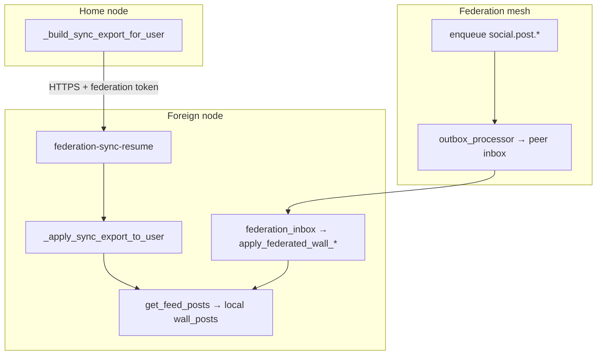

# Federation account sync & FrogSocial UX — development plan

_Last drafted: 2026-05-22 · implementation status: **Parts 1–6 shipped** (follow-up polish: peer `home_server_id` on member snapshots/blocked, export omit counts, reels CTA)_

**Next work (pagination, login auto-resync, security hardening, full UX polish):** see **[FEDERATION_SYNC_FULL_POLISH_PLAN.md](./FEDERATION_SYNC_FULL_POLISH_PLAN.md)** — implementation phases A–H plus AI auditor checklist.

Handoff doc for implementing manual resync in **Settings → Network**, reliable **FrogSocial** on non-home nodes, and fixes for live federation wall apply after account sync.

---

## 1. Problem statement

Users who log in on a **foreign FrogTalk node** (not their `account_home_server_id`) need:

1. A clear, polished way to **re-sync** account data from their home node (channels, DMs, graph, **FrogSocial posts**).
2. A feed that stays useful after sync and continues to receive **live** posts from people they follow on other servers.

Today:

| Area | Status |
|------|--------|
| Backend bulk sync (`/api/auth/federation-sync-*`) | Largely implemented; exports/applies posts, rooms, DMs, graph |
| Global sync UX (`FtSync` overlay, chip, toasts) | Exists in `app.js`; not exposed in Network settings |
| Network tab (`ui.js`) | Node probe/switch only; `#network-sync-state` shows progress **only while** `in_progress` |
| Manual resync entrypoint | `App.forceFederationResync()` exists; wired only from **Discover** empty state (`rooms.js`) |
| Live federated wall (`social.post.*` inbox) | **Broken for shadow users** after sync (see §3) |

---

## 2. Architecture (two pipelines)



- **Account sync** = one-shot pull from home (cap **300** posts, see limits below).
- **Federation mesh** = ongoing signed events; feed reads **only** local DB rows.
- Both must work; sync alone is not enough for new posts after import.

---

## 3. Root cause: shadow users misclassified as locally homed

### 3.1 Symptom

After account sync on node B, followed users are created via `ensure_federated_dm_local_user` (local `users` row + `federation_user_profiles`). New `social.post.created` events from the author’s **real** home server C are rejected in `_federated_wall_actor`:

```python
# database.py — resolve_global_user_home_server_id
if row:  # any local users row
    return local_sid  # WRONG for shadow mirrors
```

```python
# _federated_wall_actor
home = resolve_global_user_home_server_id(gid)
if home and origin and home != origin:
    return None  # drops event
```

### 3.2 Intended behavior (must preserve)

From `database.py` comment and `test_federated_calls.py`:

- **Native accounts** registered on this node → home = `local_sid` (WS call path, not federation relay).
- **Shadow mirrors** of remote users → home = `federation_user_profiles.origin_server_id`.
- **Signed-in traveler** on foreign node → `account_home_server_id` on their row points at real home (sync sets this via `set_user_account_home_server_id`).

### 3.3 Proposed resolution order (`resolve_global_user_home_server_id`)

Implement in `node/database.py` with new unit tests:

1. `origin = get_federation_profile_origin(gid)` — if `origin` and `origin != local_sid` → **return `origin`** (shadow / remote).
2. If `users` row exists for `gid`:
   - `account_home = get from users.account_home_server_id` — if set → **return `account_home`** (traveler account; may be remote).
   - Else → **return `local_sid`** (native local account).
3. If `origin` set (and equals `local_sid` or empty edge cases) → return `origin`.
4. Return `""`.

**Regression targets:** `test_federated_calls.py` (`test_is_remote_peer`, `test_apply_call_offer_drops_forged_origin`, `test_callee_home_server_routes_to_remote_peer`); add `test_resolve_home_shadow_vs_native`.

### 3.4 Sync import must pin correct origins

In `_apply_sync_export_to_user` (`auth.py`), when calling `ensure_federated_dm_local_user` for following/friends/dm_peers:

- Today: `origin_server_id=source_server_id` (exporting **home** node) for **all** peers — wrong for users homed elsewhere.
- Fix: export includes per-peer `home_server_id`; import uses that for `upsert_federation_user_profile` / `ensure_federated_dm_local_user`.

In `_build_sync_export_for_user`:

- For each following/friend/dm_peer, set `home_server_id` = `db.resolve_global_user_home_server_id(gid)` **after** §3.3 fix (on home node, native locals → local; remote follows → their pinned origin).

Posts already carry `origin_server_id` via `register_local_wall_post_global_id`; ensure import uses `row["origin_server_id"]` not only `source_server_id`.

---

## 4. Constants & API surface (reference)

### 4.1 Sync export limits (`auth.py`)

| Constant | Value |
|----------|------|
| `_SYNC_EXPORT_SOCIAL_POST_LIMIT` | 300 |
| `_SYNC_EXPORT_EXPLORE_POST_LIMIT` | 120 |
| `_SYNC_EXPORT_SOCIAL_MEDIA_MAX` | 4_000_000 chars |
| `_SYNC_EXPORT_ROOM_LIMIT` | 400 |
| `_SYNC_EXPORT_DM_LIMIT` | 400 |

### 4.2 Sync phases (`_SYNC_PHASES`)

`fetch`, `channels`, `directory`, `dms`, `social_graph`, `profile`, `social_posts`, `push`, `done`

Status endpoint: `GET /api/auth/federation-sync-status` → `_sync_state_get()` (in-memory per uid).

Actions:

| Method | Path | Role |
|--------|------|------|
| GET | `/api/auth/federation-sync-status` | Progress + counts |
| POST | `/api/auth/federation-sync-resume` | Start/continue (`source_base`, `ticket`, `force`) |
| POST | `/api/auth/federation-sync-reset` | Clear state + prune directory shells |
| GET | `/api/auth/federation-sync-export` | Home export (session) |
| POST | `/api/auth/federation-sync-export-gid` | Peer export (federation token) |

Session field: `at_home_node` from `_user_at_account_home()` in `_auth_session_response`.

### 4.3 Client sync helpers (`app.js`)

| Symbol | Role |
|--------|------|
| `FtSync` | Overlay HTML, phase icons, inline progress |
| `App.forceFederationResync()` | reset + resume `force: true` + invalidate social caches |
| `App.probeAccountSyncIfSparse()` | Auto nudge; skips if `joined >= 3` and `hadData` |
| `App.isAtHomeNode()` | `State.user.at_home_node` or `ft_sync_source_base` heuristic |
| `App._onFederationSyncComplete()` | Reload rooms, DMs, **Social.loadFeed({ force: true })**, etc. |
| Event | `ft:federation-sync` (detail = status payload) |

### 4.4 Network tab (`ui.js`)

| Element | Current behavior |
|---------|------------------|
| `ensureNetworkPaneContent()` | Builds probe/switch UI once |
| `#network-sync-state` | `_renderNetworkSyncState()` — visible only if `in_progress` |
| Listener | `ft:federation-sync` → update sync line only |

### 4.5 Wall / feed (`database.py`, `social.js`)

| Function | Role |
|----------|------|
| `get_feed_posts` | Local SQL; followers + own posts |
| `apply_synced_social_post` | Account sync import |
| `apply_federated_wall_post_created` | Inbox plaintext posts |
| `federation_wall_map` | Idempotency `origin + global_post_id → local_id` |

Existing tests: `node/tests/test_federation_sync.py` (`test_apply_synced_social_post_*`).

---

## 5. Development parts (implementation order)

Work is split into **6 parts**. Complete Part 1 before Part 2; Parts 3–4 can overlap after Part 1; Part 5 is polish; Part 6 is QA/docs.

---

### Part 1 — Backend: home resolution & origins (P0)

**Goal:** Live `social.*` federation and encrypted wrap routing work for follows on foreign nodes.

**Files:**

- `node/database.py` — `resolve_global_user_home_server_id`
- `node/tests/test_federation_sync.py` or new `test_resolve_user_home.py`
- `node/tests/test_federated_calls.py` — run full file after change

**Tasks:**

1. Implement resolution order in §3.3.
2. Add tests:
   - Shadow user: `users` row + `federation_user_profiles.origin = srv_remote` → resolves `srv_remote`.
   - Native user: `users` row, no remote origin → `local_sid`.
   - Account traveler: `account_home_server_id = srv_home`, on node B → `srv_home`.
3. Manual check: `_federated_wall_actor` accepts `social.post.created` where `origin_server_id` matches profile origin.

**Acceptance:**

- New post from followed remote author applies on foreign node without re-sync.
- Same-node DM/call still uses local WS path for native users (`is_remote_peer` false).

---

### Part 2 — Backend: sync export/import fidelity (P0)

**Goal:** Bulk sync pins correct peer homes and reports social counts accurately.

**Files:**

- `node/routers/auth.py` — `_build_sync_export_for_user`, `_apply_sync_export_to_user`, `_sync_state_get` / return dict

**Tasks:**

1. Add `home_server_id` to each `following` / `friends` / `dm_peers` export entry (resolved on home).
2. Import graph using `home_server_id` or `source_server_id` fallback for `ensure_federated_dm_local_user(..., origin_server_id=...)`.
3. Add `social_posts_skipped` counter during import (encrypted without wrap, invalid author, duplicate).
4. Expose in sync completion payload and `_sync_state_get`: `social_posts_skipped`, keep `social_posts_imported` / `social_posts_total`.
5. Optional: per-post `author_origin_server_id` in export if different from `post_origin` (for multi-home edge cases).

**Acceptance:**

- Re-sync on B after following user on home: profile origin on B matches author’s real home, not always home export server.
- Status API returns skipped count when encrypted posts lack viewer wrap.

---

### Part 3 — Frontend: Network tab account sync panel (P1)

**Goal:** Polished manual resync when `!at_home_node`.

**Files:**

- `node/static/js/ui.js` — `ensureNetworkPaneContent`, new helpers, `loadNetworkSettings`
- `node/static/js/app.js` — optional small helpers (`getHomeNodeLabel`, export sync status fetch)

**Tasks:**

1. Add HTML block **Account sync** (below connection mode or above server list):
   - **At home:** “You’re on your home node — channel and wall data are authoritative here.”
   - **Foreign:** show home URL (`ft_sync_source_base` / session), current origin, last sync stats from `GET /api/auth/federation-sync-status`.
2. Buttons:
   - **Re-sync from home** → `App.forceFederationResync()` (disabled when `App.isAtHomeNode()`).
   - **Details** → `App.openSyncOverlay()`.
3. Rewrite `_renderNetworkSyncState`:
   - **in_progress:** `FtSync.renderInline` (existing).
   - **done + error:** red message + Retry.
   - **done + success:** green summary (`N posts`, `M channels`, `K DMs`); partial if `social_posts_total > social_posts_imported`.
   - **idle foreign, never synced:** amber prompt to sync.
4. On `tab === 'network'`: fetch sync status once; bind existing `ft:federation-sync` listener (already at line ~3456).
5. Match existing modal styles (greens, `#0d0d0d` cards, `modal-btn` classes).

**Acceptance:**

- User on foreign node can resync without opening Discover or waiting for sparse probe.
- Network tab shows final counts after sync completes.

---

### Part 4 — Frontend: sync overlay & auto-probe heuristics (P1)

**Goal:** Recover from failed/stale sync; don’t skip social backfill.

**Files:**

- `node/static/js/app.js` — `FtSync.renderOverlayHtml`, `_maybeAutoOpenSyncOverlay`, `probeAccountSyncIfSparse`

**Tasks:**

1. Overlay footer when `done && error`: **Retry** (`forceFederationResync`), **Dismiss**.
2. Overlay footer when `done && !error`: brief summary + **Close** (keep auto-close delay or user dismiss).
3. Tighten `probeAccountSyncIfSparse`:
   - Remove or soften `joined >= 3` skip when `social_posts_imported === 0` or `socialPending`.
   - Change `hadData` to not require `posts > 0` if graph/rooms exist but feed empty (product choice: prefer triggering sync if posts missing).
4. Bump `ASSET_RESET_VERSION` if static cache bust needed.

**Acceptance:**

- Failed sync shows retry in overlay without console-only errors.
- Foreign node with rooms but zero posts still offers resync.

---

### Part 5 — Frontend: FrogSocial CTAs (P2)

**Goal:** Feed/explore explain home backfill and link to resync.

**Files:**

- `node/static/js/social.js` — `loadFeed`, `_renderFeedContent`, explore/reels empty states

**Tasks:**

1. When `!App.isAtHomeNode()` and empty feed:
   - If sync in progress: keep existing copy + `FtSync.renderInline`.
   - Else: empty state + button **Sync from home** → `App.forceFederationResync()`.
2. Partial sync banner when `social_posts_total > social_posts_imported` (read from `App.federationSyncState` or quick status fetch).
3. On `ft:federation-sync` done: if current tab is feed/explore, call `loadFeed({ force: true })` (redundant with `_onFederationSyncComplete` but safe for tab-not-mounted cases).

**Acceptance:**

- FrogSocial tab actionable without opening Settings.

---

### Part 6 — Tests, QA, docs (P3)

**Tests to add/update:**

| Test | File |
|------|------|
| `resolve_global_user_home_server_id` shadow vs native | `test_federation_sync.py` or new |
| Federated wall apply after shadow create | `test_federation_sync.py` |
| Export includes `home_server_id` on peers | `test_auth_federation_sync.py` (new, optional) |
| Run existing | `test_federation_sync.py`, `test_federated_calls.py` |

**Manual QA matrix:**

| # | Scenario | Expected |
|---|----------|----------|
| 1 | Register on A, switch to B, Network resync | Channels, DMs, feed posts appear |
| 2 | On B, follow remote user on C; new post on C | Appears in feed on B (Part 1 + federation enabled) |
| 3 | Resync twice | No duplicate posts (`federation_wall_map`) |
| 4 | Encrypted friends post with wrap on home | Imports on B; decrypt in client |
| 5 | At home node | No resync CTA; copy explains home authoritative |
| 6 | Sync fails (bad source URL) | Network + overlay show error + retry |

**Docs:**

- Update `docs/SECURITY_MODEL.md` §5 with one paragraph on account sync vs inbox replication.
- Optional: link this plan from `node/README.md`.

---

## 6. Out of scope (this plan)

- Enabling federation mesh in ops/env (`FROGTALK_FEDERATION_ENABLED`, tokens, directory).
- Post export pagination beyond 300 (future API cursor).
- Remote feed queries at read time (architecture stays local DB).
- Music player `mp-resync` (room play-head; unrelated to account sync).
- Fixing `room_member_snapshots` `home_server_id: source_server_id` for all members (separate voice-federation issue; note in Part 2 only if touching snapshots).

---

## 7. File checklist (quick reference)

| Part | Primary files |
|------|----------------|
| 1 | `node/database.py`, `node/tests/test_federation_sync.py`, `node/tests/test_federated_calls.py` |
| 2 | `node/routers/auth.py` |
| 3 | `node/static/js/ui.js` |
| 4 | `node/static/js/app.js` |
| 5 | `node/static/js/social.js` |
| 6 | tests + `docs/SECURITY_MODEL.md` |

---

## 8. Risk notes

| Risk | Mitigation |
|------|------------|
| Breaking call routing for local friends | Part 1 tests + `test_federated_calls` |
| Wrong origin pin on profile takeover | Keep `upsert_federation_user_profile` cross-origin guard |
| Large resync payload | Existing caps; show `social_posts_total` in UI |
| In-memory sync state lost on restart | UI treats missing state as “tap resync”; acceptable |

---

## 9. Suggested agent execution order

1. Part 1 + tests  
2. Part 2  
3. Part 3 + Part 4 (UI)  
4. Part 5  
5. Part 6 QA pass  
6. Single commit or stacked PRs per part (user preference)

---

## 10. Related code references

- Sync overlay phases: `node/routers/auth.py` `_SYNC_PHASES` (~479)
- Export social posts: `node/routers/auth.py` `_build_sync_export_for_user` (~812–956)
- Apply social posts: `node/routers/auth.py` `_apply_sync_export_to_user` (~1641–1686)
- Inbox social dispatch: `node/routers/federation.py` `_handle_social_event` (~4828)
- Feed query: `node/database.py` `get_feed_posts` (~9611)
- Network pane: `node/static/js/ui.js` `ensureNetworkPaneContent` (~2500)
