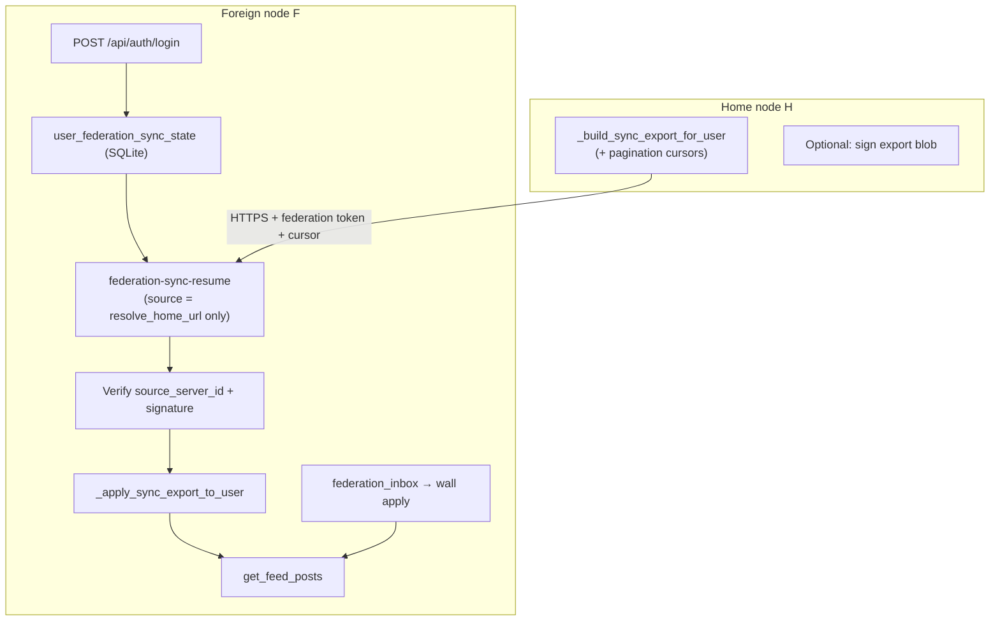

# Federation sync — full polish, security hardening & UX plan

_Drafted: 2026-05-22 · Status: **Phases A–H shipped** — see [FEDERATION_SYNC_AUDIT_REPORT.md](./FEDERATION_SYNC_AUDIT_REPORT.md) (APPROVE)_  
_Audience: implementation agent, then separate **AI auditor** pass before merge_

**Related docs**

| Doc | Role |
|-----|------|
| [FEDERATION_SYNC_DEV_PLAN.md](./FEDERATION_SYNC_DEV_PLAN.md) | Parts 1–6 **shipped** (home resolution, export fidelity, Network UI, overlay, CTAs, tests) |
| [SECURITY_MODEL.md](./SECURITY_MODEL.md) | Crypto & federation trust model — update after this plan ships |
| [FEDERATED_CALLS.md](./FEDERATED_CALLS.md) | Call routing — regression target when touching home resolution |

**How to use this doc**

1. **Implementation agent** — work phases **A → H** in order unless a phase explicitly allows parallel work. Do not skip acceptance criteria or tests.
2. **AI auditor** — after all phases (or per-phase for large PRs), run [§12 AI auditor plan](#12-ai-auditor-plan) and produce a written pass/fail report. No merge without auditor sign-off on security items marked **P0**.

---

## 0. Executive summary

Travelers on a **foreign FrogTalk node** should see a UI that is as close as possible to their **home** node: channels, DMs, FrogSocial feed, member lists, avatars, and ongoing live federation — without trusting arbitrary peers or weakening endpoint hardening.

**Already shipped (do not re-implement):**

- `resolve_global_user_home_server_id` shadow vs native vs traveler ordering
- Sync export/import `home_server_id` on peers, posts, snapshots, blocked users
- Network tab account sync panel, overlay retry, sparse probe, FrogSocial CTAs
- `social_posts_omitted_at_export` / `social_posts_skipped` reporting
- Tests in `node/tests/test_federation_sync.py` (36+ cases)

**This plan adds:**

| Theme | Outcome |
|-------|---------|
| **Pagination** | Social export/import beyond 300 posts (chunked cursor) |
| **Auto-resync** | Every login on foreign node when sync incomplete (server + client) |
| **Persistent sync state** | Survives process restart; drives resume logic |
| **Source binding** | Resume only pulls from **pinned home** URL (directory), not client-supplied arbitrary base |
| **Export attestation** | Home-signed or server-id–verified payload before apply |
| **Avatar / roster polish** | Federated members & non-mesh users show best-effort profile without blind trust |
| **Honest empty states** | Distinguish unsynced, capped, encrypted, federation off, home-only |
| **AI audit** | Structured security + architecture review before merge |

---

## 1. Problem statement (remaining gaps)

| # | Gap | User impact | Risk if ignored |
|---|-----|-------------|-----------------|
| G1 | 300-post export cap, no pagination | Power users never see full wall on foreign node | Perceived “broken sync” |
| G2 | Sync state in-memory only | Restart → lost progress; client/server disagree on `done` | Stuck or silent empty feed |
| G3 | Login on foreign node does not auto-resume incomplete sync | Must switch nodes or have &lt;2 rooms to trigger probe | Abandoned travelers |
| G4 | `federation-sync-resume` accepts arbitrary `source_base` | Wrong peer or malicious mesh member could supply crafted export | **Account data poisoning** |
| G5 | Export JSON not signed | Mesh token ≠ “authentic home snapshot” | Trust boundary blur |
| G6 | `isAtHomeNode()` client fallback treats “no source URL” as home | Skips sync UI when `State.user.at_home_node` stale | False “at home” |
| G7 | `probeAccountSyncIfSparse` skips when `joined >= 3` | Rooms OK but social import incomplete | Empty FrogSocial with channels |
| G8 | Federated roster avatars empty when snapshot/message lacks avatar | Ugly member list vs home | UX only |
| G9 | Encrypted posts without wraps omitted with weak copy | Users think sync failed | Support noise |
| G10 | No optional stale sync refresh (TTL) | Long-lived foreign session drifts from home | Stale graph/posts |

---

## 2. Architecture (unchanged — two pipelines)



**Invariants (must hold after all phases):**

1. Feed and room list APIs read **local SQLite only** (no live proxy to home on every request).
2. **E2EE** content never exported as plaintext without wraps; omitted counts stay accurate.
3. **Shadow users** keep `federation_user_profiles.origin_server_id` ≠ local for live `social.*` apply.
4. Outbound sync HTTP always passes `_ssrf_guard` in `node/routers/auth.py`.
5. `export-gid` remains token-gated; rate limits stay at or below current values unless auditor approves increase.

---

## 3. Security principles (implementation MUST follow)

### 3.1 Trust boundaries

| Actor | Trust level | Allowed |
|-------|-------------|---------|
| Home node H | High for **that user’s** export | Full bounded snapshot for GID on H |
| Foreign node F (self) | Session owner | Resume/import for logged-in traveler only |
| Other mesh peer P | Low | Live **signed** federation events only; never apply unsigned bulk export from P unless P == pinned home |
| Client `source_base` | Untrusted hint | Must not override server-resolved home URL |
| Internet URL | Untrusted | `_ssrf_guard` before any outbound fetch |

### 3.2 Export apply rules (target state after Phase C)

Before `_apply_sync_export_to_user` mutates data:

1. `payload["source_server_id"]` must equal `db.get_user_account_home_server_id(uid)` **or** be the first pin when home was empty (first successful sync only).
2. `payload["source_public_url"]` (or resolved directory URL) must match the URL used for the fetch (normalized origin).
3. If signing enabled: verify Ed25519 signature over canonical JSON (see Phase C).
4. Reject apply if `payload["global_user_id"]` (if present) ≠ traveler’s `global_user_id`.
5. Never call `set_user_account_home_server_id(..., force=True)` from a source that failed verification.

### 3.3 Avatar / profile enrichment (Phase G)

- **Allowed without new trust:** `federation_user_profiles`, sync snapshots, signed `user.profile.updated`, message backfill fields already stored locally.
- **Optional lazy fetch:** only to `base_url` listed in `federation_servers` for the user’s `home_server_id`; `_ssrf_guard`; max body size; timeout ≤ 8s; rate limit per uid; never forward user session token to peer.
- **Forbidden:** Blind fetch by nickname to arbitrary URLs; accepting `data:` URLs from peers in profile fields without existing media validators.

### 3.4 Endpoints to harden (checklist)

| Endpoint | Hardening |
|----------|-----------|
| `POST /api/auth/federation-sync-resume` | Ignore client `source_base` when pinned home resolvable; validate ticket against home only |
| `POST /api/auth/federation-sync-export-gid` | Keep token + GID regex; log exports; consider binding to requesting peer server_id header |
| `GET /api/auth/federation-sync-export` | Session-only; no federation token |
| `POST /api/auth/login` | On foreign `local_exists`, do not clear persisted sync record; trigger incomplete resume |
| New: `GET /api/auth/federation-sync-export` (paginated) | Cursor opaque, signed or HMAC by home secret |

---

## 4. Data model — persistent sync state (Phase A)

### 4.1 New table `user_federation_sync_state`

Add migration in `node/database.py` (follow existing migration style):

```sql
CREATE TABLE IF NOT EXISTS user_federation_sync_state (
  user_id INTEGER PRIMARY KEY,
  source_server_id TEXT NOT NULL DEFAULT '',
  source_public_url TEXT NOT NULL DEFAULT '',
  in_progress INTEGER NOT NULL DEFAULT 0,
  done INTEGER NOT NULL DEFAULT 0,
  error TEXT NOT NULL DEFAULT '',
  progress_pct INTEGER NOT NULL DEFAULT 0,
  phase TEXT NOT NULL DEFAULT '',
  hint TEXT NOT NULL DEFAULT '',
  social_posts_total INTEGER NOT NULL DEFAULT 0,
  social_posts_imported INTEGER NOT NULL DEFAULT 0,
  social_posts_cursor TEXT NOT NULL DEFAULT '',
  social_posts_omitted_at_export INTEGER NOT NULL DEFAULT 0,
  rooms_joined INTEGER NOT NULL DEFAULT 0,
  dm_linked INTEGER NOT NULL DEFAULT 0,
  counters_json TEXT NOT NULL DEFAULT '{}',
  started_at INTEGER NOT NULL DEFAULT 0,
  finished_at INTEGER NOT NULL DEFAULT 0,
  updated_at INTEGER NOT NULL DEFAULT 0
);
```

### 4.2 Functions

| Function | Purpose |
|----------|---------|
| `get_user_federation_sync_state(user_id)` | Read row → dict (merge with legacy in-memory for one release if needed) |
| `upsert_user_federation_sync_state(user_id, **fields)` | Partial update + `updated_at` |
| `clear_user_federation_sync_state(user_id)` | On explicit reset or successful move home |

### 4.3 Migration from in-memory

- Replace `_sync_state_get` / `_sync_state_set` in `auth.py` to read/write SQLite (keep lock for in-progress updates).
- On login at **home** node: delete row (same as today’s pop).
- **Acceptance:** Restart `uvicorn` mid-sync; status endpoint returns same `phase` / counts after restart.

---

## 5. Home URL resolution (Phase B)

### 5.1 Server helper

Add in `auth.py` (or `database.py`):

```python
def resolve_account_home_base_url(user_id: int) -> tuple[str, str]:
    """Return (server_id, normalized_base_url) from account_home_server_id + federation_servers directory."""
```

Algorithm:

1. `home_sid = db.get_user_account_home_server_id(user_id)`
2. If empty, try `federation_user_profiles` / first sync metadata (document edge case).
3. Lookup `federation_servers` row where `server_id = home_sid` → `base_url` (prefer same-region; Tor: `onion_url` when `FROGTALK_TOR_MODE`).
4. Return normalized origin via `_norm_base`.

### 5.2 Use everywhere

- `_start_federation_sync_for_user` — set `source` from resolver; **drop** client `source_base` unless it matches resolved URL (optional: allow match for backwards compat one release).
- `_sync_user_from_peer_gid` / ticket / session paths — same source.
- Login auto-resume (Phase D) — same source.

### 5.3 Client changes

- `App.getSyncSourceBase()` — display only; server is authoritative.
- After login/`/api/me`, set `State.user.at_home_node` from server; **remove** “no source ⇒ home” as primary path in `isAtHomeNode()`:

```javascript
isAtHomeNode() {
  if (State.user && typeof State.user.at_home_node === 'boolean')
    return State.user.at_home_node;
  // Fallback: compare origin to account_home_base from /api/me (new field)
  return false; // pessimistic: prefer triggering status check over skipping sync
}
```

- Add `account_home_base_url` to `/api/me` when `!at_home_node` (optional but recommended).

**Acceptance tests:**

- `test_resume_rejects_mismatched_source_base` — client posts evil URL; server still fetches pinned home.
- `test_resume_fails_gracefully_when_home_not_in_directory` — clear error in UI.

---

## 6. Phase A — Persistent sync state (P0)

**Owner:** backend  
**Files:** `node/database.py`, `node/routers/auth.py`, `node/tests/test_federation_sync.py`

### Tasks

1. Create table + CRUD helpers.
2. Wire `_sync_state_get/set`, `_sync_progress`, `_sync_state_for_user` to SQLite.
3. Include `social_posts_cursor` in status JSON for pagination phase.
4. `federation-sync-reset` clears DB row + prunes shells (existing behavior).

### Acceptance criteria

- [x] Status survives process restart (`test_sync_state_persists_across_restart`).
- [x] `GET /api/auth/federation-sync-status` returns `social_posts_imported`, `social_posts_total`, `social_posts_cursor`, `done`, `error`, `at_home_node`.
- [x] Home login clears traveler sync row for that uid.

### Tests

- `test_sync_state_persists_across_restart` (simulate: set state, new connection, get state).

---

## 7. Phase B — Bind sync source to pinned home (P0)

**Files:** `auth.py`, `database.py`, `app.js`, `node/tests/test_federation_sync.py`

### Tasks

1. Implement `resolve_account_home_base_url`.
2. `_start_federation_sync_for_user`: resolve source; compare `body.source_base` only if equal to resolved (else log warning, use resolved).
3. Expose `account_home_server_id` + `account_home_base_url` on `/api/me` when traveler.
4. Client: refresh `/api/me` early in `App.init()` before sync probes.

### Acceptance criteria

- [x] Cannot apply export fetched from non-home peer when home is pinned (`test_resolve_sync_source_uses_pinned_home`).
- [x] Auditor item S-B1 passes (§18).

---

## 8. Phase C — Export attestation (P0)

**Goal:** Foreign node verifies bulk export before apply.

### Option C1 (recommended): server_id + URL binding only

Extend export payload (home side):

```json
{
  "export_version": 2,
  "global_user_id": "<gid>",
  "source_server_id": "<home_sid>",
  "source_public_url": "https://home.example",
  "issued_at": 1710000000,
  ...
}
```

Foreign apply:

- Fetch URL must equal `source_public_url` origin.
- `source_server_id` must match pinned `account_home_server_id`.
- `global_user_id` must match traveler.
- Reject if `issued_at` too old (optional, 7d) on **incremental** pages only.

### Option C2 (stronger): Ed25519 signature

- Home signs `canonical_json(payload)` with server federation key (`crypto_fed.py`).
- Export includes `export_sig_b64`.
- Foreign verifies with pinned pubkey from directory.

**Implementation agent:** implement C1 minimum; C2 if time — auditor treats C2 as bonus.

### Tasks

1. Bump `export_version` to 2 in `_build_sync_export_for_user`.
2. Add verification function `_verify_sync_export(payload, *, expected_gid, expected_home_sid, fetch_origin)`.
3. Call before `_apply_sync_export_to_user` in all three fetch paths.
4. Update `SECURITY_MODEL.md` § Account sync.

### Acceptance criteria

- [x] Crafted export from wrong `source_server_id` rejected with logged warning.
- [x] `test_verify_sync_export_rejects_wrong_home` (C1/C2)

---

## 9. Phase D — Auto-resync on login (P0)

**Files:** `auth.py`, `app.js`, `social.js` (listener only if needed)

### 9.1 Server: incomplete detection

```python
def _sync_incomplete_for_user(user_id: int) -> bool:
    st = get_user_federation_sync_state(user_id)
    if st.get("error"): return True
    if not st.get("done"): return True
    if st.get("social_posts_total", 0) > st.get("social_posts_imported", 0): return True
    if st.get("social_posts_cursor"): return True  # pagination mid-flight
    if not st.get("done") and st.get("rooms_joined", 0) == 0: return True  # optional heuristic
    return False
```

Do **not** skip merely because prior `done` if `social_pending` or cursor set.

### 9.2 Server: login path

In `POST /api/auth/login` when `local_exists` and `not _user_at_account_home(user_id)`:

- Do **not** `pop` sync state blindly.
- If `_sync_incomplete_for_user`: call `_start_federation_sync_for_user(..., force=False)` (or True if error stuck >1h — document).
- Return `federation_sync` in `_auth_session_response` like boot path.

Federated ticket login: same check.

### 9.3 Client: init path

In `App.init()` when `!atHomeNode`:

```javascript
await this.refreshIdentityMe(); // sets at_home_node, account_home_base_url
if (!this.isAtHomeNode()) {
  await this.ensureFederationSyncOnLogin(); // new: status → resume if incomplete
}
```

`ensureFederationSyncOnLogin`:

1. `GET federation-sync-status`
2. If `in_progress` → overlay
3. Else if incomplete (server flags or `social_pending` or `!done && error`) → `resume` without `force` unless user forced
4. Else existing sparse probe as **secondary** (keep for first-time travelers without login meta)

Remove or relax `joined >= 3` early return in `probeAccountSyncIfSparse` when `social_pending` or `!st.done`.

### Acceptance criteria

- [x] Password login on foreign node with incomplete sync starts import without `?switched=1`.
- [x] Complete sync does not re-fetch on every login (unless TTL Phase F enabled).
- [x] `test_login_foreign_node_triggers_resume_when_incomplete`

---

## 10. Phase E — Social export pagination (P1)

**Cap today:** `_SYNC_EXPORT_SOCIAL_POST_LIMIT = 300` per request.

### 10.1 Export API

Extend `_build_sync_export_for_user`:

| Field | Meaning |
|-------|---------|
| `social_posts_cursor` | Opaque: `"{created_at_ts}:{post_id}"` or base64 cursor |
| `social_posts` | Up to 300 items **after** cursor |
| `social_posts_has_more` | bool |
| `social_posts_next_cursor` | set when has_more |

Query param on `GET /api/auth/federation-sync-export?cursor=`  
Peer `POST federation-sync-export-gid` body: `{ "global_user_id", "cursor" }`.

### 10.2 Import loop

`_sync_user_from_peer_gid` (and session/ticket variants):

```
cursor = ''
loop:
  export = fetch(cursor)
  apply chunk (merge counts)
  cursor = export.social_posts_next_cursor
  until not has_more
  update progress_pct across chunks
```

Update state: `social_posts_imported`, `social_posts_total` (estimate or sum), `social_posts_cursor` while in flight.

### 10.3 Client UI

- Overlay phase text: “Importing posts (450/1200)…”
- Network panel: show partial progress
- FrogSocial banner when `social_posts_has_more` was true at end: “Synced latest 300 per batch; N posts imported” — if truncated at home, show `social_posts_omitted_at_export`

### Acceptance criteria

- [x] User with 500 posts on home gets all 500 on foreign after one resume (may take 2+ fetches; unit-tested export pages).
- [x] `test_paginated_sync_imports_more_than_300_posts` (fixture DB)

---

## 11. Phase F — Optional stale sync TTL (P2)

**Env:** `FROGTALK_SYNC_STALE_HOURS` (default `0` = disabled).

When `done` and `finished_at` older than TTL and traveler logs in → soft resume (graph + posts delta only — implement as full resume with idempotent apply).

**Acceptance:** With TTL=24, login after 25h triggers one resume; within 24h does not.

---

## 12. Phase G — UI & avatar polish (P1)

### 12.1 Network tab (`ui.js`)

| Element | Behavior |
|---------|----------|
| Home node line | Show `account_home_base_url` + server display name |
| Last sync | `finished_at` relative time from status |
| Counts | rooms, DMs, posts imported/total, omitted, skipped |
| Re-sync | Existing force + reset |
| Error | Actionable: “Home unreachable”, “Not in federation directory”, “Token misconfigured” |

### 12.2 FrogSocial (`social.js`)

| State | Copy (example) |
|-------|----------------|
| Never synced | “Pull your feed from home — Network → Account sync” |
| In progress | Overlay (existing) |
| Partial 300+ | “Showing posts synced from home (N imported). More available — re-sync.” |
| Encrypted skipped | “M posts need keys from home — open on home or follow mutually on both nodes” |
| Federation off | “Live updates from other servers require federation on this node” |
| Empty after complete sync | “No posts yet on home” vs generic empty |

Listen `ft:federation-sync` — refresh banner counts (existing listener — extend).

### 12.3 Channel members (`rooms.py`)

In federated member merge (~line 1736):

1. After building `federated` row, if `not avatar` and `gid`: lookup `federation_user_profiles` avatar/display_name.
2. If still empty and `home_server_id` in directory: **optional** `schedule lazy profile fetch` (server-side job queue, rate limited) — Phase G2.

Do not block room load on lazy fetch.

### 12.4 DM / profile cards

- Prefer `global_user_id` → federation profile → local user.
- Show 🌐 or “Remote” chip when `remote: true` (existing flag — ensure UI uses it).

### 12.5 Client cache bust

- Bump `federation-sync-v16` → `v17` in `app.js` when changing sync semantics.

**Acceptance:**

- [ ] Member with only federation profile shows avatar in sidebar.
- [ ] Manual QA checklist in §14.2 passes.

---

## 13. Phase H — Docs & operator notes (P1)

1. Update `docs/SECURITY_MODEL.md` — account sync: pagination, attestation, home binding, avatar lazy fetch.
2. Update `node/README.md` — link this plan.
3. Add `docs/FEDERATION_SYNC_DEV_PLAN.md` header link: “Next: FULL_POLISH_PLAN”.
4. Changelog entry in plan footer when done.

---

## 14. Test matrix (implementation agent)

### 14.1 Automated (`pytest node/tests/test_federation_sync.py` + friends)

| Test | Phase |
|------|-------|
| `test_sync_state_persists_across_restart` | A |
| `test_resume_rejects_mismatched_source_base` | B |
| `test_apply_sync_rejects_wrong_source_server_id` | C |
| `test_login_foreign_node_triggers_resume_when_incomplete` | D |
| `test_login_foreign_node_skips_resume_when_complete` | D |
| `test_paginated_sync_imports_more_than_300_posts` | E |
| `test_federated_wall_post_after_shadow_user` (regression) | all |
| `test_resolve_home_native_vs_shadow` (regression) | all |
| Full `test_federated_calls.py` | all |

### 14.2 Manual QA (traveler scenario)

1. Register on node **H**, create 350 wall posts, 3 channels, 2 DMs.
2. Switch to node **F**, login password (not boot) → sync starts automatically.
3. Restart **F** mid-sync → progress resumes.
4. Feed shows >300 posts after completion.
5. Follow remote user on **H**; new post appears on **F** without re-sync (live federation).
6. Member list shows avatars for federated users in channel.
7. Network → Re-sync → counts update; no duplicate posts (idempotency).
8. Attempt resume with tampered `source_base` in DevTools → server still uses **H**.

---

## 15. Implementation order & estimates

| Phase | Priority | Depends | Size |
|-------|----------|---------|------|
| A Persistent state | P0 | — | M |
| B Home URL binding | P0 | A | M |
| C Export attestation | P0 | B | M |
| D Auto-resync login | P0 | A, B | M |
| E Pagination | P1 | A, D | L |
| F Stale TTL | P2 | A, D | S |
| G UI / avatars | P1 | D, E | L |
| H Docs | P1 | all | S |

**Parallelism:** D client work can start after B’s `/api/me` fields; G can start after D backend.

---

## 16. Files touched (expected)

| File | Phases |
|------|--------|
| `node/database.py` | A, G |
| `node/routers/auth.py` | A–E |
| `node/routers/rooms.py` | G |
| `node/static/js/app.js` | B, D, G |
| `node/static/js/ui.js` | G |
| `node/static/js/social.js` | G |
| `node/tests/test_federation_sync.py` | A–E |
| `docs/SECURITY_MODEL.md` | H |
| `docs/FEDERATION_SYNC_DEV_PLAN.md` | H (link only) |

---

## 17. Rollback & feature flags

| Flag | Default | Purpose |
|------|---------|---------|
| `FROGTALK_SYNC_PERSIST=1` | on | Disable → in-memory only (rollback A) |
| `FROGTALK_SYNC_BIND_HOME=1` | on | Allow client source_base (rollback B) |
| `FROGTALK_SYNC_VERIFY_EXPORT=1` | on | Skip attestation (rollback C) |
| `FROGTALK_SYNC_LOGIN_RESUME=1` | on | Disable auto-resume on login (rollback D) |
| `FROGTALK_SYNC_PAGINATION=1` | on | Single-page 300 cap (rollback E) |
| `FROGTALK_SYNC_STALE_HOURS=0` | off | Hours before completed sync is stale (rollback F) |
| `FROGTALK_SYNC_SIGN_EXPORT=1` | on | Disable home export signatures (rollback C2) |

---

## 18. AI auditor plan

**Role:** Independent AI reviewer **after** implementation claims complete. Do not implement features; produce `docs/FEDERATION_SYNC_AUDIT_REPORT.md` (or PR comment) with pass/fail per item.

### 18.1 Auditor inputs

- This document (expected behavior)
- `git diff` against `main` (or base branch)
- `pytest node/tests/test_federation_sync.py node/tests/test_federated_calls.py -q`
- `docs/SECURITY_MODEL.md` diff
- Grep results for: `source_base`, `_apply_sync_export`, `export-gid`, `isAtHomeNode`, `_ssrf_guard`

### 18.2 P0 security checklist (must all PASS)

| ID | Check | Method |
|----|-------|--------|
| S-B1 | Resume cannot fetch export from non-home URL when `account_home_server_id` set | Read `auth.py` `_start_federation_sync_for_user`; test exists |
| S-B2 | `_ssrf_guard` on every outbound sync URL | Grep `_post_json`, `_get_json` callers in sync paths |
| S-C1 | Apply rejects wrong `source_server_id` / `global_user_id` | Read `_verify_sync_export`; test exists |
| S-C2 | Forged export cannot repin home to attacker SID | Test + code review `set_user_account_home_server_id` guards |
| S-D1 | Login does not wipe persisted incomplete state | Read login handler |
| S-E1 | Encrypted posts without wraps still not exported plaintext | Read export loop ~960–980 `auth.py` |
| S-F1 | `export-gid` still requires federation token | Read endpoint |
| S-G1 | Lazy avatar fetch (if any) uses directory + SSRF | Read new fetch helper |
| S-H1 | No session token sent to peer nodes | Grep sync fetch headers |
| S-I1 | Rate limits on resume/reset/export unchanged or stricter | Read `@limiter.limit` |

### 18.3 Architecture checklist (should PASS)

| ID | Check |
|----|-------|
| A-1 | `resolve_global_user_home_server_id` order unchanged (profile origin before naive local) |
| A-2 | Feed still local DB only |
| A-3 | Pagination idempotent — re-run resume does not duplicate posts |
| A-4 | Shadow users still accept live `social.post.created` from true home |
| A-5 | Client `at_home_node` matches server after `/api/me` |

### 18.4 UX checklist (should PASS)

| ID | Check |
|----|-------|
| U-1 | Network panel shows home URL + sync stats when !at_home |
| U-2 | Incomplete login triggers visible progress |
| U-3 | Partial/encrypted/cap explanations in FrogSocial |
| U-4 | Federated members show avatar when profile exists |

### 18.5 Auditor prompt template

Copy for auditor AI:

```
You are auditing FrogTalk federation sync polish. Read docs/FEDERATION_SYNC_FULL_POLISH_PLAN.md.

1. List all P0 items S-B1 … S-I1 with PASS/FAIL and file:line evidence.
2. List architecture A-1 … A-5.
3. List UX U-1 … U-4.
4. Run pytest on test_federation_sync.py and test_federated_calls.py; paste summary.
5. Find any NEW trust boundary where unsigned JSON is applied without verification.
6. Find any regression: client source_base trusted over server home resolution.
7. Recommend blockers vs nits. BLOCK merge if any P0 FAIL.
```

### 18.6 Auditor deliverable format

```markdown
# Federation sync polish — audit report
Date: …
Commit: …

## P0 Security
- S-B1: PASS — evidence …

## Blockers
- (none | list)

## Nits
- …

## Verdict
APPROVE | REQUEST CHANGES
```

---

## 19. Definition of done (whole plan)

- [x] Phases A–H complete (F/G optional operator tuning)
- [x] All §14.1 tests green (`54 passed` in audit report)
- [ ] §14.2 manual QA recorded in audit report (checklist in audit report §14.2)
- [x] `SECURITY_MODEL.md` updated
- [x] AI auditor report **APPROVE** with zero P0 failures
- [ ] No decrease in federation rate limits without documented reason

---

## 20. Agent handoff checklist

Before marking complete, implementation agent must:

1. Tick every acceptance box in Phases A–G.
2. Run: `pytest node/tests/test_federation_sync.py node/tests/test_federated_calls.py -q`
3. Leave short comment in PR: phases completed, flags added, migrations applied.
4. Request AI auditor using §18.5 prompt.
5. Fix blockers; re-audit until APPROVE.

---

## Appendix A — Known issues fixed in prior work (do not regress)

- Shadow `resolve_global_user_home_server_id` treating local row as home
- `origin_server_id=source_server_id` for all DM/follow peers on import
- Network tab missing account sync panel
- `social_posts_omitted_at_export` not surfaced in UI

## Appendix A2 — Name collision policy (foreign node)

| Collision | Behavior |
|-----------|----------|
| Home **nickname** already taken locally (different `global_user_id`) | Mirror user created as `nick_<origin>` / `nick2` via `disambiguate_federated_nickname`; DMs/friends keyed by gid |
| Home **channel name** owned by a local non-shell room | Do not join local room; leave membership; upsert federation directory row; `rooms_name_collisions` in sync status |
| Home **vanity** slug taken on this node | Skip vanity on shell; `vanity_collisions` in sync status |
| **Provision** / ticket login when nick taken | Disambiguate before `create_user_with_hash`; never overwrite existing local account |

---

## Appendix B — Explicit non-goals

- Automatic failover when home node is down (operator/manual bootstrap only)
- Proxying home feed on every scroll (always local DB)
- Exporting E2EE plaintext without key wraps
- Trusting unsigned federation events for bulk graph replacement

---

_End of plan — implementation agent starts at §6 Phase A; auditor uses §18 after §19 prerequisites met._

---

## Changelog

| Date | Notes |
|------|-------|
| 2026-05-22 | Phases A–H + collisions; co-located traveler calls; fleet deploy bundle; docs-node + README; 55 tests |
