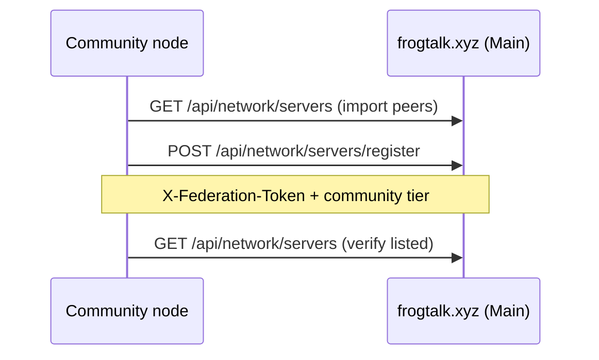

# FrogTalk node — VPS install guide

This guide walks through running a **FrogTalk federation node** on a clean Linux VPS: clone the repo, run the **CLI setup wizard**, join the public mesh, put **nginx** in front, and verify sync with the official directory.

- **Public reference node:** [https://frogtalk.xyz](https://frogtalk.xyz)
- **Live operator page (same content, shorter):** [https://frogtalk.xyz/docs/node](https://frogtalk.xyz/docs/node)
- **Node quick start (scripts):** [node/README.md](../node/README.md)
- **Typical install root:** `/opt/frogtalk`

> **Security:** Never commit `.env`, SSH passwords, federation tokens, or private keys. Use SSH keys for login; store secrets only on the server. This document uses placeholders like `<YOUR_DOMAIN>`, `<YOUR_VPS_IP>`, and `<SSH_USER>`.

---

## What you are installing

A FrogTalk **node** is a self-contained stack:

| Piece | Role |
|-------|------|
| **FastAPI app** (`node/main.py`) | REST + WebSocket API, web client, admin |
| **SQLite** (`data/frogtalk.db`) | Users, rooms, federation inbox/outbox |
| **Vanilla JS UI** (`node/static/`) | Browser app at `/app` |
| **Optional PHP board** (`node/board/`) | Frog Channel imageboard at `/board/` |
| **Federation** | Ed25519-signed events; directory sync from `frogtalk.xyz` |

The **install wizard** is a **bash CLI** (`node/scripts/node_setup_wizard.sh` via `install.sh setup`) — not a browser page. After the node is up, users register at `/app` and admins use the `admin` account from `.env`.

---

## Recommended VPS specs

| Size | vCPU | RAM | Disk | Notes |
|------|------|-----|------|-------|
| **Small** (friends / family) | 1 | 2 GB | 20 GB | SQLite + light traffic |
| **Medium** (community) | 2 | 4 GB | 40 GB | Board uploads, federation |
| **Busy** | 4+ | 8 GB+ | 80 GB+ | Many peers, media, coturn for calls |

**OS:** Debian 12, Ubuntu 22.04/24.04 LTS, or similar systemd-based Linux. **Python:** 3.10+ (3.11+ recommended; Docker image uses 3.12).

---

## Quick install (copy-paste)

Run these on a **fresh VPS** as a user with `sudo` (SSH keys recommended — see section 1).

Replace `<YOUR_VPS_IP>` with your public IPv4 (or use a domain in `PUBLIC_URL` once DNS works).

```bash
# 1) Packages
sudo apt update
sudo apt install -y git python3 python3-venv python3-pip curl nginx ufw sqlite3

# 2) Service user + install root (matches frogtalk.service User=deploy)
sudo adduser --disabled-password --gecos "" deploy
sudo mkdir -p /opt/frogtalk
sudo chown deploy:deploy /opt/frogtalk

# 3) Clone (official repo)
sudo -u deploy git clone https://github.com/deadinternetfox/frogtalk.git /opt/frogtalk
cd /opt/frogtalk

# 4) Your public URL and node name (clearnet / non-Tor example)
export PUBLIC_URL="http://<YOUR_VPS_IP>"
export FROGTALK_SERVER_NAME="My FrogTalk Node"

# 5) Install wizard + mesh + systemd (non-interactive -y)
#    Export FROGTALK_FEDERATION_TOKEN (same as Main) before setup for hub auto-listing.
export FROGTALK_FEDERATION_TOKEN="<same-as-main>"
bash node/scripts/install.sh setup -y --install-dir /opt/frogtalk --public-url "$PUBLIC_URL"
bash node/scripts/install.sh federation -y --install-dir /opt/frogtalk --public-url "$PUBLIC_URL"
sudo bash node/scripts/install.sh systemd -y --install-dir /opt/frogtalk

# 6) nginx reverse proxy (uvicorn stays on 127.0.0.1:8080)
sudo tee /etc/nginx/sites-available/frogtalk >/dev/null <<'EOF'
server {
    listen 80 default_server;
    listen [::]:80 default_server;
    server_name _;
    location / {
        proxy_pass http://127.0.0.1:8080;
        proxy_http_version 1.1;
        proxy_set_header Upgrade $http_upgrade;
        proxy_set_header Connection "upgrade";
        proxy_set_header Host $host;
        proxy_set_header X-Real-IP $remote_addr;
        proxy_set_header X-Forwarded-For $proxy_add_x_forwarded_for;
        proxy_set_header X-Forwarded-Proto $scheme;
    }
}
EOF
sudo ln -sf /etc/nginx/sites-available/frogtalk /etc/nginx/sites-enabled/frogtalk
sudo rm -f /etc/nginx/sites-enabled/default
sudo nginx -t && sudo systemctl reload nginx

# 7) Firewall
sudo ufw allow OpenSSH
sudo ufw allow 80/tcp
sudo ufw allow 443/tcp
sudo ufw --force enable

# 8) Verify
bash node/scripts/install.sh status --install-dir /opt/frogtalk
curl -sS "$PUBLIC_URL/api/ping"
curl -sS "$PUBLIC_URL/api/network/status" | python3 -m json.tool
```

Open **`$PUBLIC_URL/app`**, log in as user **`admin`** (password in `/opt/frogtalk/.env` → `ADMIN_PASSWORD`), and rotate the password.

**Tor-only nodes:** skip `PUBLIC_URL` clearnet; set `FROGTALK_TOR_ENABLED=1` and `FROGTALK_ONION_URL=http://….onion` in `.env`, then re-run federation join (wizard asks in interactive mode; in `-y` set vars before `setup` or edit `.env` after).

---

## Overview (interactive)

```bash
sudo apt update && sudo apt install -y git python3 python3-venv python3-pip \
  curl nginx certbot python3-certbot-nginx ufw

sudo adduser --disabled-password --gecos "" deploy
sudo mkdir -p /opt/frogtalk && sudo chown deploy:deploy /opt/frogtalk

sudo -u deploy git clone https://github.com/deadinternetfox/frogtalk.git /opt/frogtalk
cd /opt/frogtalk

# Menu: setup · federation · systemd · status
bash node/scripts/install.sh

# Or non-interactive (set PUBLIC_URL / FROGTALK_SERVER_NAME first):
bash node/scripts/install.sh setup -y --public-url "https://chat.yourdomain.com"
bash node/scripts/install.sh federation -y --public-url "https://chat.yourdomain.com"
sudo bash node/scripts/install.sh systemd -y
```

Then point DNS at the VPS, configure nginx + TLS, open the firewall, and verify federation (sections below).

---

## 1) Bootstrap the VPS (SSH, user, firewall)

### SSH access

Prefer **SSH keys**, not passwords, for day-to-day access:

```bash
# On your laptop
ssh-keygen -t ed25519 -f ~/.ssh/frogtalk_vps -C "frogtalk-ops"
ssh-copy-id -i ~/.ssh/frogtalk_vps.pub <SSH_USER>@<YOUR_VPS_IP>
ssh -i ~/.ssh/frogtalk_vps <SSH_USER>@<YOUR_VPS_IP>
```

If the provider gave a one-time root password, use it only for first login, create an unprivileged user, install your key, then **disable password authentication** in `sshd_config` when you are sure key login works.

Do **not** store provider passwords in git, wiki, or ticket comments.

### Dedicated service user (recommended)

```bash
sudo adduser --disabled-password --gecos "" deploy
sudo usermod -aG sudo deploy   # optional: sudo for systemd/nginx
sudo mkdir -p /opt/frogtalk
sudo chown deploy:deploy /opt/frogtalk
```

The shipped unit file runs as `User=deploy` ([`node/deploy/frogtalk.service`](../node/deploy/frogtalk.service)). Clone and run the wizard as `deploy` (or adjust `User=` in the unit). Run **`systemd`** install with `sudo` if you are not root.

### Firewall (UFW example)

```bash
sudo ufw default deny incoming
sudo ufw default allow outgoing
sudo ufw allow OpenSSH
sudo ufw allow 80/tcp    # HTTP (certbot + redirect)
sudo ufw allow 443/tcp   # HTTPS
# Do NOT expose uvicorn 8080 publicly if nginx terminates TLS
sudo ufw enable
sudo ufw status
```

Federation uses **outbound HTTPS** from your node to peers. Inbound federation push hits your **public URL** (nginx → `127.0.0.1:8080`).

---

## 2) DNS (optional if using IP only)

Create records pointing at your VPS:

| Type | Name | Value |
|------|------|--------|
| **A** | `chat` (or `@`) | `<YOUR_VPS_IPV4>` |
| **AAAA** | same | `<YOUR_VPS_IPV6>` (optional) |

Example hostname: `chat.yourdomain.com` → use this as `PUBLIC_URL=https://chat.yourdomain.com`.

**IP-only test nodes** can use `PUBLIC_URL=http://<YOUR_VPS_IP>` (no TLS) as in the quick install above.

Propagation can take minutes to hours. Test:

```bash
dig +short chat.yourdomain.com A
curl -sI "http://chat.yourdomain.com" | head -5
```

---

## 3) Clone repo and run the install wizard

```bash
sudo -u deploy git clone https://github.com/deadinternetfox/frogtalk.git /opt/frogtalk
cd /opt/frogtalk

bash node/scripts/install.sh
```

Menu commands:

| Command | Purpose |
|---------|---------|
| `setup` | First-time: `venv`, `.env`, runtime symlinks |
| `federation` | Join mesh: directory sync, pubkey pin, board nav |
| `systemd` | Install `frogtalk.service` |
| `update` / `update-apply` | Git fast-forward + pip + restart |
| `status` | Ping API + list federation peers |

Non-interactive (set `PUBLIC_URL` and optional `FROGTALK_SERVER_NAME` first):

```bash
export PUBLIC_URL="https://chat.yourdomain.com"
export FROGTALK_SERVER_NAME="My Node"

bash node/scripts/install.sh setup -y --install-dir /opt/frogtalk --public-url "$PUBLIC_URL"
bash node/scripts/install.sh federation -y --install-dir /opt/frogtalk --public-url "$PUBLIC_URL"
sudo bash node/scripts/install.sh systemd -y --install-dir /opt/frogtalk
```

### What the wizard does

- Creates `/opt/frogtalk/venv/` and installs `node/requirements.txt`
- Copies `node/deploy/env.example` → `.env` (if missing)
- Sets `PUBLIC_URL`, `ADMIN_PASSWORD`, `HOST=127.0.0.1`, `PORT=8080`, federation defaults
- Symlinks `node/data` → `../data`, `node/.env` → `../.env`, `node/secrets` → `../secrets`
- Optionally runs `node_federation_join.sh` (passes your `--public-url`)

In **`-y` mode**, git pull during setup is skipped (use `install.sh update-apply -y` later). Scripts also avoid reading stdin when not attached to a TTY, so piping a multi-line shell script into `setup -y` is safe.

### Manual equivalent (no wizard)

```bash
cd /opt/frogtalk
python3 -m venv venv && source venv/bin/activate
pip install -r node/requirements.txt
cp node/deploy/env.example .env
# Edit .env — see node/deploy/env.example
mkdir -p data secrets
ln -sfn /opt/frogtalk/data    node/data
ln -sfn /opt/frogtalk/.env    node/.env
ln -sfn /opt/frogtalk/secrets node/secrets
cd node && python main.py   # http://127.0.0.1:8080
```

### Admin account

On first boot the app creates user **`admin`**. If `ADMIN_PASSWORD` in `.env` is empty, a **one-time random password** is generated and saved in `.env` — log in at `/app` and rotate immediately.

---

## 4) Configure `.env` (essentials)

```bash
nano /opt/frogtalk/.env
```

| Variable | Purpose |
|----------|---------|
| `HOST` / `PORT` | Bind address (`127.0.0.1:8080` behind nginx — wizard sets this in `-y`) |
| `PUBLIC_URL` | Clearnet URL peers and clients use |
| `FROGTALK_SERVER_NAME` | Display name in federation / network UI |
| `ALLOWED_ORIGINS` | CORS — include your public URL |
| `ADMIN_PASSWORD` | Bootstrap admin (or leave empty for auto-generated) |
| `FROGTALK_FEDERATION_ENABLED=1` | Enable federation |
| `FROGTALK_FEDERATION_REQUIRE_SIGS=1` | Reject unsigned inbox events (recommended) |
| `FROGTALK_TOR_ENABLED=0` | Clearnet node (set `1` + `FROGTALK_ONION_URL` for Tor-only) |
| `FROGTALK_OFFICIAL_DIRECTORY_URL` | Default `https://frogtalk.xyz/api/network/servers` |
| `FROGTALK_FEDERATION_TOKEN` | Same value on **Main** and community nodes — hub register + signed push |
| `FROGTALK_OFFICIAL_DIRECTORY_REGISTER_URL` | Optional override (default: directory URL + `/register`) |
| `FROGTALK_AUTO_UPDATE_ENABLED=0` | Opt-in updates only |

Generate a federation shared secret once on FrogTalk Main, then distribute to operators (never commit):

```bash
openssl rand -hex 32
```

Set `FROGTALK_FEDERATION_TOKEN` in `/opt/frogtalk/.env` on Main and on each community node. Without it, federation join still imports peers but **does not** POST your node to the global directory.

---

## 5) Federation join (sync into the mesh)

```bash
bash node/scripts/install.sh federation -y --install-dir /opt/frogtalk \
  --public-url "https://chat.yourdomain.com"
```

Or directly:

```bash
bash node/scripts/node_federation_join.sh --install-dir /opt/frogtalk -y \
  --public-url https://chat.yourdomain.com
```

This script:

1. Ensures `node/data` is a **symlink** (not an empty real folder)
2. Enables federation keys in `.env`
3. Pulls the [official directory](https://frogtalk.xyz/api/network/servers)
4. **Announces** this node on the hub (`POST …/servers/register` with `X-Federation-Token`) when `FROGTALK_FEDERATION_TOKEN` matches Main
5. **TOFU-pins** peer Ed25519 keys from each peer’s `GET /api/network/status` (after the service is running)
6. Links Frog Channel peer nav pills (unless `--skip-board` or `php` is not installed)

If the directory is unreachable, a built-in fallback seeds two **verified production** peers:

| Display name | Role |
|--------------|------|
| **FrogTalk Main** | `https://frogtalk.xyz` |
| **FrogTalk Tor Mirror** | `.onion` mirror (see directory / network UI) |

Re-run safely after changing `PUBLIC_URL` or onion settings:

```bash
bash node/scripts/install.sh federation -y --public-url "$PUBLIC_URL"
sudo systemctl restart frogtalk
```

### Verify federation

```bash
bash node/scripts/install.sh status --install-dir /opt/frogtalk
curl -sS "$PUBLIC_URL/api/network/status" | python3 -m json.tool
sqlite3 /opt/frogtalk/data/frogtalk.db \
  "SELECT display_name, enabled, length(COALESCE(server_pubkey,'')) FROM federation_servers;"
```

Re-run federation after the service is up if peer `pubkey` lengths are still zero.

### List on the official directory

The authoritative mesh list is **Main’s** database, exposed at:

```bash
curl -sS https://frogtalk.xyz/api/network/servers | python3 -m json.tool
```

**On FrogTalk Main** (once per fleet): add the same token to `/opt/frogtalk/.env`:

```bash
# on Main only — generate once, share securely with node operators
FROGTALK_FEDERATION_TOKEN=<paste-openssl-rand-hex-32>
sudo systemctl restart frogtalk
```

**On each community node:** set the same token, set `PUBLIC_URL` / `FROGTALK_SERVER_NAME`, then re-run federation join. The join script registers with the hub and verifies your `server_id` appears in the directory feed.



**Verify global listing** (not your local API):

```bash
curl -sS https://frogtalk.xyz/api/network/servers \
  | python3 -c "import sys,json; print([s.get('display_name') for s in json.load(sys.stdin).get('servers',[])])"
```

**Important:** `GET /api/network/servers` on **your own** node injects the local server into the JSON even when you are **not** on Main — that is not proof of global listing. Always check `frogtalk.xyz`.

**Troubleshooting — “peers see me only locally”**

| Symptom | Fix |
|---------|-----|
| Join OK but absent on `frogtalk.xyz` | Set matching `FROGTALK_FEDERATION_TOKEN` on Main and node; re-run `federation -y` |
| Register returns 403 | Token mismatch or missing on Main |
| Skipped with `no_public_base_url` | Set `PUBLIC_URL` to a reachable clearnet URL (onion-only needs manual hub listing) |
| `register_http_4xx` | Check `PUBLIC_URL` is not `localhost`; hub host must match directory URL |

---

## 6) systemd service

```bash
sudo bash node/scripts/install.sh systemd -y --install-dir /opt/frogtalk
```

Or manually:

```bash
sudo cp /opt/frogtalk/node/deploy/frogtalk.service /etc/systemd/system/frogtalk.service
# Edit User= if not using `deploy`
sudo systemctl daemon-reload
sudo systemctl enable --now frogtalk
sudo systemctl status frogtalk --no-pager
journalctl -u frogtalk -f
```

---

## 7) nginx reverse proxy + HTTPS

Keep uvicorn on **localhost** only. Example site (`/etc/nginx/sites-available/frogtalk`):

```nginx
server {
    listen 80;
    server_name chat.yourdomain.com;
    location / {
        proxy_pass http://127.0.0.1:8080;
        proxy_http_version 1.1;
        proxy_set_header Upgrade $http_upgrade;
        proxy_set_header Connection "upgrade";
        proxy_set_header Host $host;
        proxy_set_header X-Real-IP $remote_addr;
        proxy_set_header X-Forwarded-For $proxy_add_x_forwarded_for;
        proxy_set_header X-Forwarded-Proto $scheme;
    }
}
```

```bash
sudo ln -sf /etc/nginx/sites-available/frogtalk /etc/nginx/sites-enabled/
sudo nginx -t && sudo systemctl reload nginx
sudo certbot --nginx -d chat.yourdomain.com
```

Align ports: default app `PORT=8080` in `.env` must match `proxy_pass`. The template in `node/deploy/nginx.conf` may reference port **8000** — change upstream or `.env` so they match.

Reference: [`node/deploy/nginx.conf`](../node/deploy/nginx.conf), [`node/deploy/README.md`](../node/deploy/README.md).

---

## 8) Optional: Frog Channel (PHP)

If you serve `/board/` via php-fpm:

```bash
sudo apt install -y php-fpm php-cli php-curl
sudo chown -R www-data:www-data /opt/frogtalk/node/board/board_data \
  /opt/frogtalk/node/board/board_uploads \
  /opt/frogtalk/node/board/board_previews
bash node/scripts/install.sh federation -y --install-dir /opt/frogtalk
```

Configure nginx to pass `*.php` under `/board/` to php-fpm (see board README).

---

## 9) Health checks

```bash
curl -sS "$PUBLIC_URL/api/ping"
curl -sS "$PUBLIC_URL/api/network/status"
curl -sS "$PUBLIC_URL/api/network/build/local"
```

Open `$PUBLIC_URL/app` — register a test user, join a room, confirm WebSocket connectivity.

In the app: **Settings → Network** — probe peers, compare build hash with [frogtalk.xyz](https://frogtalk.xyz) when federating.

---

## 10) Backup and upgrades

### Backup

```bash
sudo systemctl stop frogtalk
tar -czf frogtalk-backup-$(date +%F).tar.gz \
  /opt/frogtalk/.env \
  /opt/frogtalk/data/frogtalk.db \
  /opt/frogtalk/data/uploads \
  /opt/frogtalk/secrets
sudo systemctl start frogtalk
```

### Upgrade

```bash
bash node/scripts/install.sh update          # preview
bash node/scripts/install.sh update-apply -y # pull, pip, restart
bash node/scripts/install.sh federation -y     # refresh peers after major releases
```

Hot SCP deploy (`node/scripts/deploy_nodes.sh`) does **not** run DB migrations — prefer `update-apply` when `database.py` changes.

---

## Troubleshooting

| Symptom | Likely cause | Fix |
|---------|----------------|-----|
| Wizard clones into a nonsense directory | Piped stdin into `setup -y` (older scripts) | Use current `install.sh` / wizard, or run commands one at a time |
| Empty DB / `no such table` | `node/data` is a real directory | Wizard symlink repair or `node_federation_join.sh` |
| API works on `:8080` but not via domain | nginx upstream port mismatch | Match `PORT` in `.env` and `proxy_pass` |
| `nginx -t` fails on `proxy_set_header` | Config pasted with mangled `$host` | Use the heredoc in quick install (`<<'EOF'`) so `$` is literal |
| Federation peers, no delivery | Missing pubkey pin | Start frogtalk, then re-run `federation -y` |
| Listed locally, not on frogtalk.xyz | No hub register | Set `FROGTALK_FEDERATION_TOKEN` on Main + node; re-run `federation -y`; verify curl to `frogtalk.xyz` |
| Directory sync fails | Outbound firewall / DNS | Check `curl` to `frogtalk.xyz`; fallback peers still seed mesh |
| CORS errors in browser | `ALLOWED_ORIGINS` | Add your public URL |
| Board step fails on `curl_init` | Missing PHP curl extension | `sudo apt install php-curl` and re-run federation |
| `systemd` step permission denied | Not root | `sudo bash node/scripts/install.sh systemd -y` |
| WebRTC calls fail cross-node | No TURN | Set `FROGTALK_FEDERATION_CALLS_ENABLED=1` + coturn — [`FEDERATED_CALLS.md`](FEDERATED_CALLS.md) |

Logs: `journalctl -u frogtalk -n 100 --no-pager`, nginx `error.log`.

---

## Security checklist

- [ ] SSH key auth; disable root password login when stable
- [ ] UFW: only 22, 80, 443 (or your SSH port)
- [ ] Strong `ADMIN_PASSWORD`; rotate after first login
- [ ] `FROGTALK_FEDERATION_REQUIRE_SIGS=1`
- [ ] `FROGTALK_AUTO_UPDATE_ENABLED=0` unless you trust release signers
- [ ] Set `FROGTALK_RELEASE_SIGNERS` before enabling auto-apply
- [ ] `.env` mode `600`, owned by service user
- [ ] Do not expose uvicorn directly on the public internet

Report issues: [frogtalk.xyz/security](https://frogtalk.xyz/security)

---

## See also

- [Repository README](../README.md)
- [Node README](../node/README.md)
- [Deploy templates](../node/deploy/README.md)
- [API docs](https://frogtalk.xyz/docs/api)
- [Security model](SECURITY_MODEL.md)
- [Federated calls](FEDERATED_CALLS.md)
